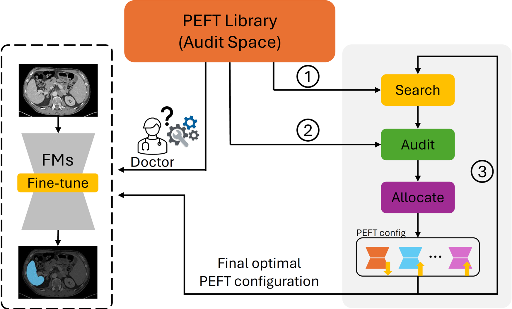

# Search, Audit, and Allocate: Toward Expert-Free Fine-Tuning of Foundation Models for Medical Image Segmentation

There are many recent advances in parameter-efficient fine-tuning (PEFT) of foundation models for medical image segmentation. However:

```
1. Is there any doctor-friendly and engineering-free method?
2. How likely are clinical doctors to have enough engineering expertise to fine-tune foundation models using PEFTs?
3. How likely are typical clinical sites have the engineering support necessary to implement PEFTs in real-world clinical practice?
```
To address these questions, we introduce SElf-Auditing Parameter-Efficient Fine-Tuning, **SEA-PEFT**. SEA-PEFT converts standard adapters into self-optimizing units: within a closed-loop search–audit–allocate cycle, adapters are trained briefly, individually toggled off to estimate their task-level utility, stabilized through a lightweight statistical scorer, and then reselected under a global parameter budget using a greedy, knapsack-style allocator.

<p align="center">

<p align="left"> Adapting foundation models to new clinical sites is difficult without support from machine-learning engineers. We propose SEA-PEFT to fully automate this process. The method operates over a library of candidate PEFT units (“audit space”) and iteratively executes three steps: (1) Search proposes a small set of adapters to probe under the current parameter budget; (2) Audit performs lightweight on/off perturbation tests and tracks each unit’s Dice-per-cost utility using a robust EMA+IQR estimator; (3) Allocate updates the active configuration through budget-aware rank adjustments. This closed-loop process refines the adapter set during fine-tuning, converging to a stable, high-utility configuration without manual design. The final PEFT configuration can then be deployed directly by clinicians on new patient scans. 
</p>

### 0. Installation
```
pip install 'monai[all]'
pip install -r requirements.txt
```

### 1. Datasets
Please download [TotalSegmentator](https://zenodo.org/records/6802614#.ZBDA3dLMKV4) and [FLARE](https://flare22.grand-challenge.org/), then place them inside ```local_data/datasets```.
* The employed train/test splits are located at  `local_data/partitions/transferability.txt`.
* Check `local_data/datasets/README.md` for an overview on how to organize these datasets.

### 2. Pre-trained models
Please, download the dataset from the weights link provided, and store it at models/pretrained_weights/[ID].pth for its use.

For reported results in our paper, we use pre-trained Swin-UNETR backbone [fseft.pth](https://drive.google.com/file/d/18yLNxmWGnVifQNeYYwyyu56Cg4tWV9aW/view?usp=sharing)

### 3. SEA-PEFT
Inside `./sea_peft`:
* `manifest/default_composite.yaml`: PEFT library configurations.
* `episode.py`: Episode runner for SEA-PEFT search.
* `allocator.py`: Greedy Dice-first allocator with guard cycles and hysteresis
* `sampler.py`: Audit sampling utilities with coverage and debt tracking.
* `units.py`: PEFT unit registry and wrappers.
* `utility.py`: Utility smoothing for SA-PEFT units.
* `logger.py`: CSV logging utilities for SA-PEFT episodes.

### 4. Running experiments
* To run SEA-PEFT experiments (running search-audit-allocate) to find the optimal PEFT configs:
```
python main_sea_peft.py \
  --organ ${organ} \
  --k ${shot} \
  --out_path ${out_path} \
  --dataset ${dataset} \
  --param_budget 0.05 \
  --manifest_path sea_peft/manifest/default_composite.yaml \
```

* To run the final fine-tuning with available optimal PEFT configs (after running search-audit-allocate above):
```
python main_fseft.py \
      --manifest_path ${default_composite.yaml} \
      --config_file ${final_configs.yaml path} \
      --organ ${organ} \
      --k ${shot} \
      --out_path ${out_path} \
      --dataset ${dataset} \
      --early_stop_criteria ${early} \
      --model_id ${model} \
      --lr ${lr} \
      --visualization True
```
See `main_sea_peft.py` and `main_fseft.py` for all detailed options.

### Acknowledgement

* The framework is build upon the [MONAI](https://github.com/Project-MONAI/MONAI) library for medical image segmentation.
* We thank the authors [Towards Foundation Models and Few-Shot Parameter-Efficient Fine-Tuning for Volumetric Organ Segmentation](https://github.com/jusiro/fewshot-finetuning) for their open-sourced codebase on few-shot fine-tuning of volumetric medical image segmentation and pre-training of the foundational model.
